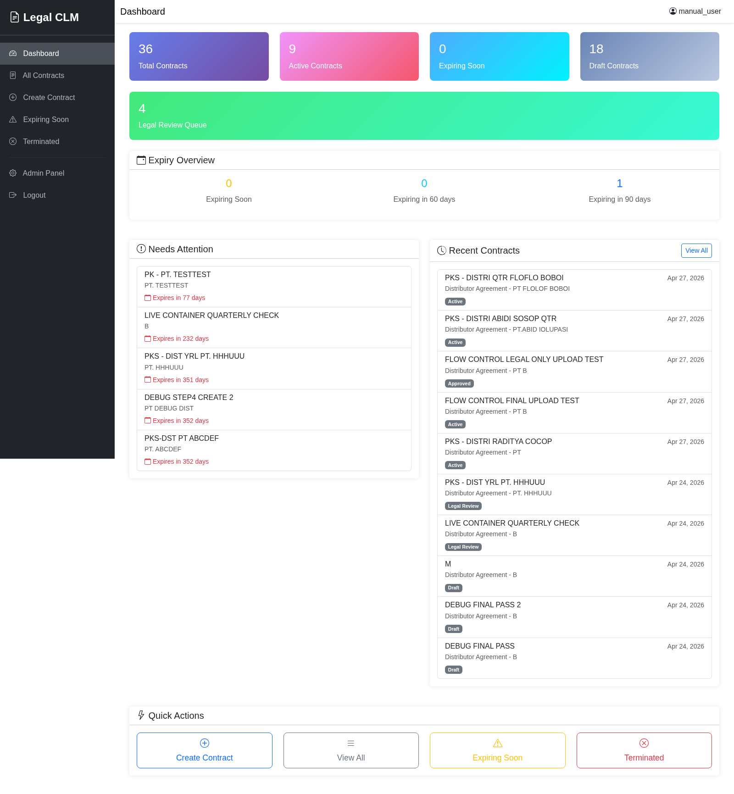
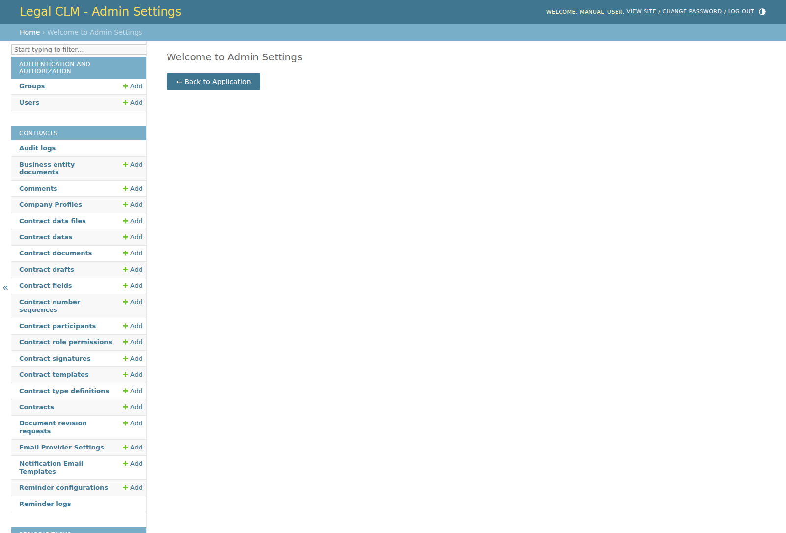
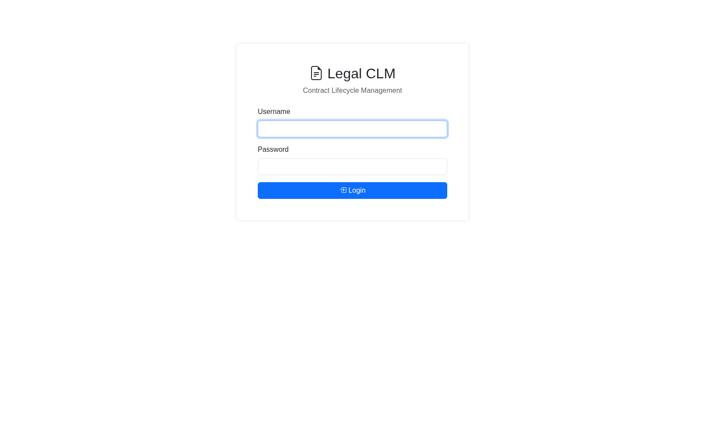
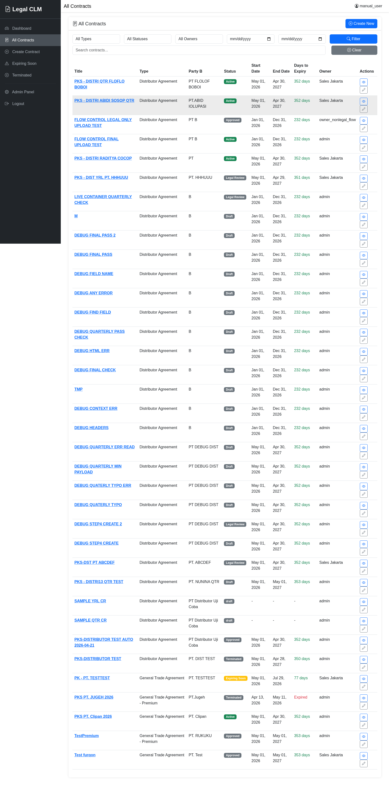
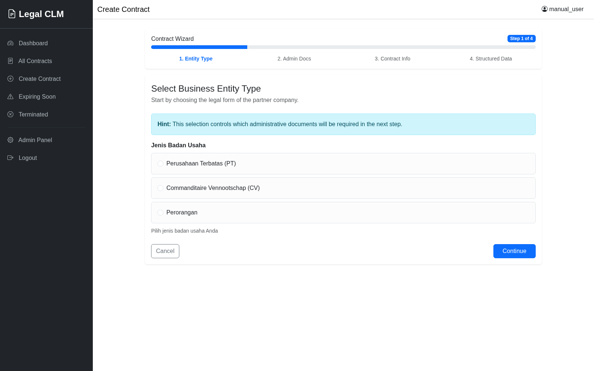
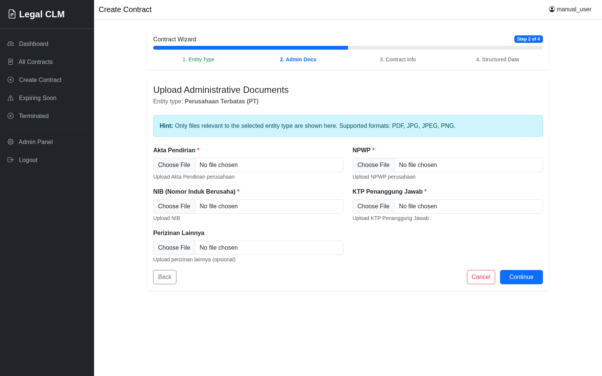
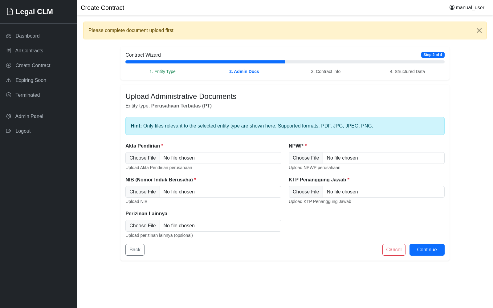
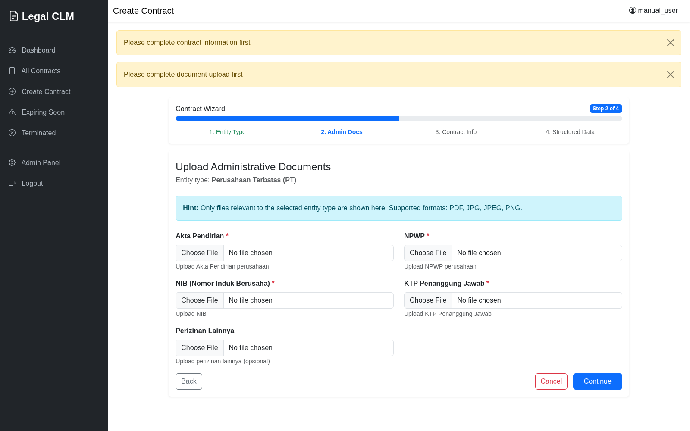
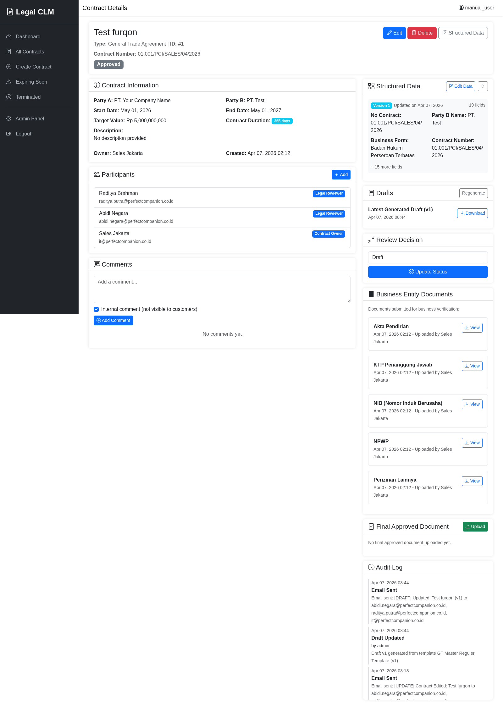
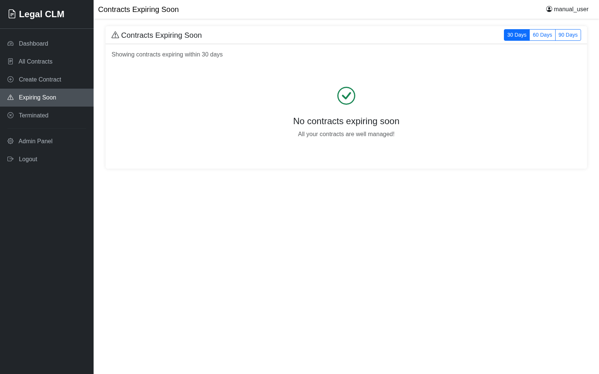

# LEGAL CLM HANDBOOK

## Contract Lifecycle Management User Guide

Organization: PT Perfect Companion Indonesia  
System: Legal CLM  
Document Type: End-User Handbook  
Version: 2.2  
Effective Date: 12 May 2026

---

## Approval And Document Control

| Field | Value |
|---|---|
| Document owner | Legal Operations |
| Prepared by | CLM Project Team |
| Approved by | Head of Legal |
| Review cycle | Every 6 months |
| Distribution | Internal users only |

### Revision History

| Version | Date | Summary Of Change | Author |
|---|---|---|---|
| 1.0 | 12 May 2026 | Initial user manual | CLM Project Team |
| 2.0 | 12 May 2026 | Full handbook format, SOP structure, appendices | CLM Project Team |
| 2.1 | 12 May 2026 | Added inline visual placeholders in relevant sections | CLM Project Team |
| 2.2 | 13 May 2026 | Added system and administration flow guidance | CLM Project Team |

---

## Table Of Contents

1. Purpose And Scope
2. Audience And Roles
3. System Access Requirements
4. User Interface Map
5. Core Flows
6. Standard Operating Procedures (SOP)
7. Contract Lifecycle Guide
8. Role-Based Responsibilities
9. Service Standards And Controls
10. Troubleshooting Guide
11. Frequently Asked Questions
12. Glossary
13. Support And Escalation
14. PDF Export Guidance
15. Appendix A: Quick Start Cards
16. Appendix B: Pre-Submission Checklist
17. Appendix C: Suggested Screenshot Index

---

## 1. Purpose And Scope

This handbook is the official user reference for Legal CLM. It explains how users create, review, manage, and monitor contracts from draft stage through active and expiry stages.

This handbook covers:
- login and daily navigation
- contract creation and data input
- participant, document, comment, and signature handling
- status management and reminders
- role-based behavior and controls
- common error handling and support flow

This handbook does not cover:
- server deployment steps
- source code changes
- infrastructure administration outside the app

---

## 2. Audience And Roles

This handbook is designed for:
- Contract Owner: creates and manages contracts
- Legal Reviewer: reviews legal content and status transitions
- Business User: submits business data and documents
- Signatory: signs contracts when requested
- Staff/Admin User: configures system master data and permissions

If your role is unclear, contact your administrator before performing any contract action.

---

## 3. System Access Requirements

Before using Legal CLM, confirm:
- you have a valid username and password
- your user account is active
- your browser is up to date
- required contract files are available
- you have permission to access the relevant contract

Security rules:
- never share your password
- always log out after use
- avoid using shared devices without logging out

---

## 4. User Interface Map

### Main Navigation Menu

After login, the left sidebar contains:
- Dashboard
- All Contracts
- Create Contract
- Expiring Soon
- Terminated
- Admin Panel (staff/admin only)
- Logout

### Core Screens

- Dashboard: KPI and action-oriented overview
- All Contracts: searchable contract registry
- Contract Detail: complete contract record with actions
- Contract Wizard: 4-step guided contract creation
- Expiring Soon: proactive expiry monitoring
- Admin Panel: setup and governance controls

---

## 5. Core Flows

Use this section when you want to understand the system as a process, not just as individual screens.

### 5.1 System Flow

The normal user flow is:

Login -> Dashboard -> All Contracts or Create Contract -> Contract Detail -> Participants / Documents / Comments / Status -> Expiring Soon monitoring -> Logout

How to use the flow:
- start at Dashboard after login
- use All Contracts when you need to find an existing record
- use Create Contract when you are starting a new agreement
- use Contract Detail for editing, comments, participants, and documents
- use Expiring Soon for renewal and closure follow-up

### 5.2 Administration Flow

The normal administration flow is:

Login as Staff/Admin -> Open Admin Panel -> Review master data -> Configure contract types / fields / templates / permissions / email settings -> Save changes -> Test using a normal user path -> Logout

How to use the flow:
- make changes only if you are authorized
- change one configuration group at a time
- validate the result by creating or reviewing a sample contract
- confirm users can still login and complete the expected workflow

### 5.3 Contract Creation Flow

Create Contract -> Select entity type -> Upload administrative documents -> Fill contract information -> Fill structured data -> Save -> Review draft -> Submit for legal review

Key control points:
- entity type decides what fields and documents are required
- missing files or invalid values stop the process
- the contract should only move forward when all required items are complete

### 5.4 Review And Revision Flow

Open Contract Detail -> Read documents and comments -> Add legal or business comment -> Request revision if needed -> Upload revised document -> Recheck -> Approve or update status

Key control points:
- comments should clearly say what must be fixed
- revisions should match the exact issue raised
- final approval should happen only after the correction is verified

---

## 6. Standard Operating Procedures (SOP)

## SOP 01 - Login And Logout

Objective: Access the system safely.

How this flow works:
- you authenticate first
- the system sends you to Dashboard
- you end the session by logging out

### Steps

1. Open the Legal CLM URL.
2. Enter username and password.
3. Click Login.
4. Confirm Dashboard appears.
5. At end of session, click Logout.

### Success Criteria

- user reaches Dashboard after login
- user session ends after logout

### Common Errors

- invalid credentials
- inactive user

### Corrective Action

- re-enter credentials carefully
- contact admin for account activation

---

## SOP 02 - Find A Contract

Objective: Locate the correct contract quickly.

How this flow works:
- start from All Contracts
- narrow the list using filters or search
- open the correct record before making changes

### Steps

1. Open All Contracts.
2. Use filters: type, status, owner, start date, end date.
3. Use keyword search for title or party.
4. Open the contract by clicking its title.

### Success Criteria

- correct contract detail page opens

### Control Point

- verify contract number and party before editing

---

## SOP 03 - Create A Contract (4-Step Wizard)

Objective: Create a valid contract record and initial package.

How this flow works:
- step 1 chooses the legal entity type
- step 2 collects supporting documents
- step 3 captures contract header information
- step 4 stores structured template data
- the system then creates the draft contract record

### Step 1: Business Entity Type

1. Click Create Contract.
2. Select partner legal entity type.
3. Click Continue.

Control note: this selection controls required documents and fields.

### Step 2: Administrative Documents

1. Upload required administrative documents.
2. Confirm each file is attached to correct field.
3. Click Continue.

File quality note:
- use clear files
- use allowed file formats shown on screen

### Step 3: Contract Information

1. Complete core contract data:
- title
- contract type
- party information
- dates
- value
- description
2. Review field validation messages.
3. Click Continue.

Date note:
- some templates auto-calculate end date from start date and duration

### Step 4: Structured Data

1. Fill template-specific fields.
2. Review required fields.
3. Click Save Data or Finish and Create Contract.

### Success Criteria

- contract is created
- data is saved
- draft generation occurs when template applies

---

## SOP 04 - Manage Contract Detail Actions

Objective: Perform post-creation contract actions safely.

How this flow works:
- open the contract detail page
- review current status and permissions
- choose the action you need
- save and confirm the change in the contract history

### Available actions (depends on role)

- edit contract
- add participants
- upload documents
- add comments
- update status
- open structured data page
- upload final approved document

### Control Point

Before any action, verify:
- contract number
- current status
- ownership and permissions

---

## SOP 05 - Add Participants

Objective: Add relevant users to contract workflow.

How this flow works:
- participant setup happens from Contract Detail
- each participant gets a role in the workflow
- the role controls what the person can do next

### Steps

1. Open Contract Detail.
2. Click Add Participant (if visible).
3. Select user and role.
4. Save.

### Success Criteria

- participant appears in participant list

### Risk Control

- avoid assigning incorrect role
- confirm participant email/account is correct

---

## SOP 06 - Document And Signature Handling

Objective: Keep document trail complete and auditable.

How this flow works:
- upload the working or supporting file first
- request or collect signature when required
- keep the final approved version clearly identified

### Document actions

- upload source/supporting documents
- upload revised documents when requested
- upload final approved document

### Signature actions

- signatory opens signature request
- signs contract digitally
- system stores signer, timestamp, and IP metadata

### Control Point

- confirm uploaded file is final version before final upload

---

## SOP 07 - Comment And Revision Management

Objective: Ensure all review communication is captured.

How this flow works:
- add the review comment on the contract record
- request correction with a clear instruction
- upload the revised file after the fix
- recheck before approval

### Steps

1. Open Contract Detail.
2. Add comment with clear instruction.
3. If revision requested, mention exact section or issue.
4. Upload revised document when completed.

### Good Practice

- use clear, actionable comments
- avoid vague comments like please revise

---

## SOP 08 - Expiry Monitoring

Objective: Prevent missed renewals and contract lapses.

How this flow works:
- review the Expiring Soon list regularly
- prioritize contracts closest to end date
- open each contract and decide renewal, closure, or follow-up

### Steps

1. Open Expiring Soon page.
2. Review contracts by urgency.
3. Open each affected contract.
4. Coordinate renewal or closure action.

### Reminder Types

- expiry reminders
- pending signature reminders
- renewal notifications

---

## 6. Contract Lifecycle Guide

Typical lifecycle path:
- Draft
- Submitted for Review
- Legal Review
- Approved
- Active
- Expiring Soon
- Expired

Terminated contracts are managed separately and appear in Terminated.

### Lifecycle Governance Note

Not all users can move status at every stage. Status transition rights are controlled by role and permission settings.

---

## 7. Role-Based Responsibilities

| Role | Typical Responsibilities | Typical Restrictions |
|---|---|---|
| Contract Owner | Create contract, manage data, coordinate participants | Cannot perform admin configuration unless granted |
| Legal Reviewer | Legal review, request correction, approve legal readiness | Cannot access admin setup unless staff/admin |
| Business User | Fill business fields and upload relevant documents | May have limited status transition rights |
| Signatory | Provide digital signature when requested | No broader edit rights by default |
| Staff/Admin | Configure types, fields, templates, permissions, email settings | Must follow governance and change control |

---

## 8. Service Standards And Controls

### Data Quality Standards

- mandatory fields must be completed before submission
- dates must follow contractual logic
- uploaded files must be readable and relevant

### Auditability Standards

- key actions should be traceable in contract history/audit logs
- critical communication should be made through comments

### Access Control Standards

- users act within assigned role scope
- missing buttons usually indicate permission limitation

---

## 9. Troubleshooting Guide

### Issue: Cannot Login

Possible causes:
- incorrect credentials
- inactive account
- session issue

Resolution:
1. re-enter credentials carefully
2. ensure Caps Lock is off
3. contact administrator

### Issue: Contract Not Found

Possible causes:
- wrong filter
- no access to contract
- search keyword mismatch

Resolution:
1. clear filters and search again
2. try by contract type and date
3. ask owner/admin to confirm access

### Issue: Validation Error During Form Submission

Possible causes:
- required fields missing
- wrong data format
- invalid file type

Resolution:
1. read error text under field
2. complete required fields
3. upload allowed file format

### Issue: Button Not Visible

Possible causes:
- permission restriction
- status-based restriction

Resolution:
1. check your role
2. ask legal/admin for access confirmation

---

## 10. Frequently Asked Questions

### Q1. Can I edit a contract after submission?

It depends on current status and your permission role.

### Q2. Why does end date auto-fill in some forms?

Certain contract types use start date plus duration logic.

### Q3. How do I know a contract is urgent?

Check Expiring Soon and status indicators in list/detail views.

### Q4. Where should legal comments be written?

Use the contract comment section to maintain traceable history.

### Q5. Who can use Admin Panel?

Only staff/admin users with required permissions.

---

## 11. Glossary

| Term | Meaning |
|---|---|
| CLM | Contract Lifecycle Management |
| Dashboard | Main summary page after login |
| Structured Data | Template-specific dynamic input fields |
| Participant | Person assigned to contract workflow |
| Draft | Early contract stage before full approval |
| Active | Live valid contract stage |
| Expiring Soon | Contract nearing end date |
| Terminated | Contract ended early before normal expiry |
| Final Approved Document | Final document version accepted for record |

---

## 12. Support And Escalation

Primary support line:
- Internal CLM Administrator

Functional escalation:
- Legal Team

Technical escalation:
- System Support / IT Team

When raising a support request, include:
- username
- contract number (if relevant)
- screen name
- clear error message or screenshot
- time of issue

---

## 13. PDF Export Guidance

To generate a clean PDF from this handbook:

1. Open the markdown in your editor preview.
2. Confirm headings and tables are rendered correctly.
3. Keep screenshots in manual-images with the filenames listed in Appendix C.
4. Export to PDF using your preferred markdown-to-PDF tool.
5. Verify page breaks and table alignment.

Suggested print settings:
- paper: A4
- margins: normal
- orientation: portrait
- include table headers on page breaks if supported

---

## 14. Appendix A: Quick Start Cards

### Card 1 - Daily User

1. Login
2. Open Dashboard
3. Check urgent items
4. Open target contract
5. Update comments/documents/status
6. Logout

### Card 2 - Contract Creator

1. Create Contract
2. Complete Steps 1 to 4
3. Validate required fields
4. Submit
5. Monitor review feedback

### Card 3 - Legal Reviewer

1. Open review queue/contracts list
2. Read details and documents
3. Add legal comments
4. Request revision or update status

---

## 15. Appendix B: Pre-Submission Checklist

Use this checklist before final submission:

- all required fields completed
- legal entity type correctly selected
- party names and addresses verified
- start and end dates verified
- contract value checked
- required supporting documents uploaded
- participant roles checked
- comments added for special conditions
- final review completed

---

## 16. Appendix C: Suggested Screenshot Index

Replace placeholders with these final image files:

1. img-01-login.png
2. img-02-dashboard.png
3. img-03-contract-list.png
4. img-04-wizard-step-1.png
5. img-05-wizard-step-2.png
6. img-06-wizard-step-3.png
7. img-07-wizard-step-4.png
8. img-08-contract-detail.png
9. img-09-participant-section.png
10. img-10-document-upload.png
11. img-11-comment-section.png
12. img-12-expiring-soon.png
13. img-13-admin-panel.png

---

End of handbook.
